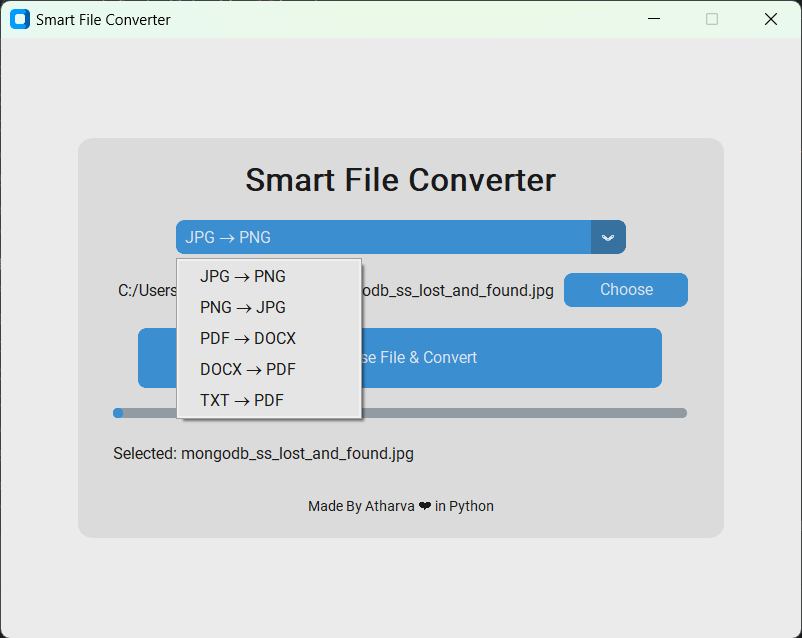

# 🧠 Smart File Converter

A simple yet elegant **Python GUI application** that allows users to convert files between common formats easily.  
Built using **CustomTkinter** for a clean, light-mode interface and simple logic suitable for students and interviews.

---

## 🖼️ Project Preview



---

## 🚀 Features

✅ Modern **Light Mode UI** using `CustomTkinter`  
✅ **Five Supported Conversions**
1. JPG → PNG  
2. PNG → JPG  
3. PDF → DOCX  
4. DOCX → PDF  
5. TXT → PDF  
✅ Smooth progress bar and file chooser  
✅ Error handling for wrong file types or missing selections  
✅ Clean design — easy to understand and present  
✅ Ideal for academic or portfolio demonstration projects  

---

## 🧩 Tech Stack

- **Language:** Python  
- **UI Library:** CustomTkinter  
- **Other Libraries:**
  - Pillow (`PIL`) — for image conversion
  - PyPDF2 — for reading PDFs
  - python-docx — for DOCX creation
  - reportlab — for PDF generation
  - docx2pdf — for DOCX → PDF conversion

---

## ⚙️ Installation

Make sure Python ≥ 3.10 is installed.  
Then run these commands in your terminal:

```bash
pip install customtkinter pillow PyPDF2 python-docx reportlab docx2pdf
